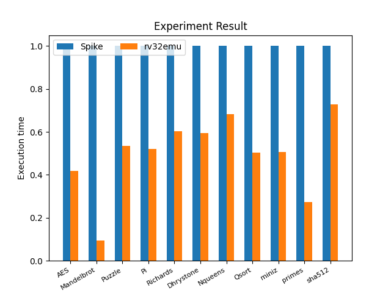
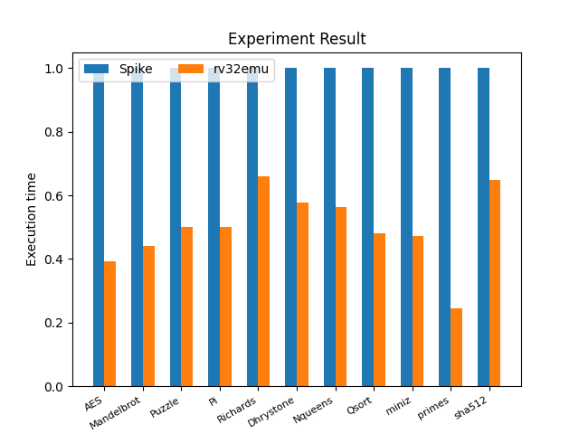
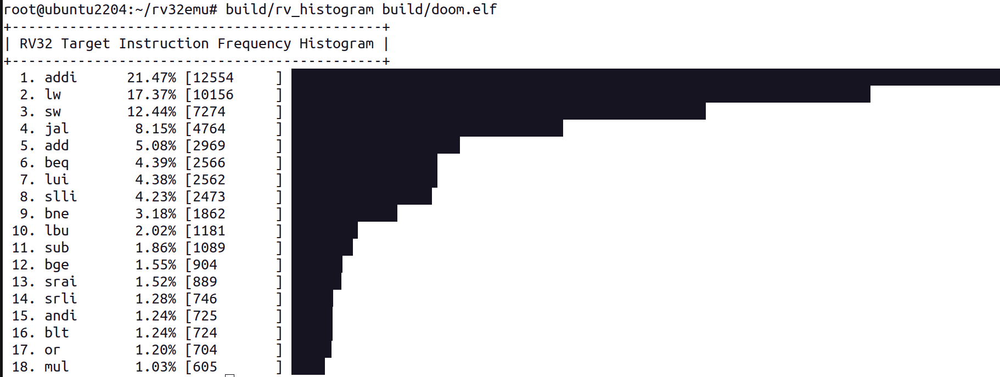
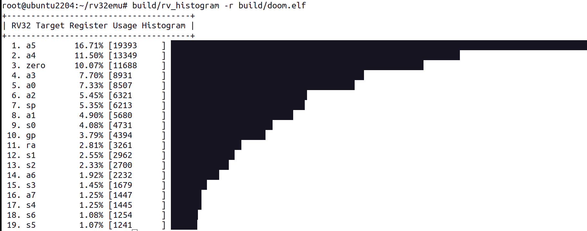

# RISC-V RV32I[MAFC] emulator

```
                       /--===============------\
      ______     __    | |⎺⎺⎺⎺⎺⎺⎺⎺⎺⎺⎺⎺⎺⎺⎺|     |
     |  _ \ \   / /    | |               |     |
     | |_) \ \ / /     | |   Emulator!   |     |
     |  _ < \ V /      | |               |     |
     |_| \_\ \_/       | |_______________|     |
      _________        |                   ::::|
     |___ /___ \       '======================='
       |_ \ __) |      //-'-'-'-'-'-'-'-'-'-'-\\
      ___) / __/      //_'_'_'_'_'_'_'_'_'_'_'_\\
     |____/_____|     [-------------------------]
```

`rv32emu` is an emulator for the 32 bit [RISC-V processor model](https://riscv.org/technical/specifications/) (RV32),
faithfully implementing the RISC-V instruction set architecture (ISA).
It serves as an exercise in modeling a modern RISC-based processor, demonstrating
the device's operations without the complexities of a hardware implementation.
The code is designed to be accessible and expandable, making it an ideal educational
tool and starting point for customization. It is primarily written in C99, with
a focus on efficiency and readability.

Features:
* Fast interpreter for executing the RV32 ISA
* Comprehensive support for RV32I and M, A, F, C extensions
* Memory-efficient design
* Built-in ELF loader
* Implementation of commonly used newlib system calls
* Experimental SDL-based display/event/audio system calls for running video games
* Support for remote GDB debugging
* Tiered JIT compilation for performance boost while maintaining a small footprint

## Build and Verify

`rv32emu` relies on certain third-party packages for full functionality and access to all its features.
To ensure proper operation, the target system should have the [SDL2 library](https://www.libsdl.org/)
and [SDL2_Mixer library](https://wiki.libsdl.org/SDL2_mixer) installed.
* macOS: `brew install sdl2 sdl2_mixer`
* Ubuntu Linux / Debian: `sudo apt install libsdl2-dev libsdl2-mixer-dev`

### Experimental JIT compilation
The tier-2 JIT compiler in `rv32emu` leverages LLVM for powerful optimization.
Therefore, the target system must have [`LLVM`](https://llvm.org/) installed, with version 17 recommended.
If `LLVM` is not installed, only the tier-1 JIT compiler will be used for performance enhancement.

* macOS: `brew install llvm@18`
* Ubuntu Linux / Debian: `sudo apt-get install llvm-18`

Build the emulator with experimental JIT compiler:
```shell
$ make ENABLE_JIT=1
```

If you don't want the JIT compilation feature, simply build with the following:
```shell
$ make
```

### Experimental system emulation
Device Tree compiler (dtc) is required. To install it on Debian/Ubuntu Linux, enter the following command:
```
$ sudo apt install device-tree-compiler
```
For macOS, use the following command:
```
$ brew install dtc
```

#### Build and run system emulation
Build and run using default images (the default images will be fetched from [rv32emu-prebuilt](https://github.com/sysprog21/rv32emu-prebuilt) before running):
```shell
$ make ENABLE_SYSTEM=1 system
```

Build using run using specified images:
```shell
$ make ENABLE_SYSTEM=1
$ build/rv32emu -k <kernel_img_path> -i <rootfs_img_path> -b <dtb_path>
```

#### Build Linux image
An automated build script is provided to compile the RISC-V cross-compiler, Busybox, and Linux kernel from source. Please note that it only supports the Linux host environment. It can be found at tools/build-linux-image.sh.
```
$ make build-linux-img
```

### Verify with prebuilt RISC-V ELF files

Run sample RV32I[M] programs:
```shell
$ make check
```

Run [Doom](https://en.wikipedia.org/wiki/Doom_(1993_video_game)), the classical video game, via `rv32emu`:
```shell
$ make doom
```

The build script will then download data file for Doom automatically.
When Doom is loaded and run, an SDL2-based window ought to appear.

If RV32F support is enabled (turned on by default), [Quake](https://en.wikipedia.org/wiki/Quake_(series))
demo program can be launched via:
```shell
$ make quake
```

The usage and limitations of Doom and Quake demo are listed in [docs/demo.md](docs/demo.md).

### Docker image

The image containing all the necessary tools for development and testing can be executed by `docker run -it sysprog21/rv32emu:latest`. It works for both x86-64 and aarch64 (e.g., Apple's M1 chip) machines.

### Customization

`rv32emu` is configurable, and you can override the below variable(s) to fit your expectations:
* `ENABLE_EXT_M`: Standard Extension for Integer Multiplication and Division
* `ENABLE_EXT_A`: Standard Extension for Atomic Instructions
* `ENABLE_EXT_F`: Standard Extension for Single-Precision Floating Point Instructions
* `ENABLE_EXT_C`: Standard Extension for Compressed Instructions (RV32C.D excluded)
* `ENABLE_Zicsr`: Control and Status Register (CSR)
* `ENABLE_Zifencei`: Instruction-Fetch Fence
* `ENABLE_GDBSTUB` : GDB remote debugging support
* `ENABLE_FULL4G` : Full access to 4 GiB address space
* `ENABLE_SDL` : Experimental Display and Event System Calls
* `ENABLE_JIT` : Experimental JIT compiler
* `ENABLE_SYSTEM`: Experimental system emulation, allowing booting Linux kernel. To enable this feature, additional features must also be enabled. However, by default, when `ENABLE_SYSTEM` is enabled, CSR, fence, integer multiplication/division, and atomic Instructions are automatically enabled
* `ENABLE_MOP_FUSION` : Macro-operation fusion
* `ENABLE_BLOCK_CHAINING` : Block chaining of translated blocks

e.g., run `make ENABLE_EXT_F=0` for the build without floating-point support.

Alternatively, configure the above items in advance by executing `make config` and
specifying them in a configuration file. Subsequently, run `make` according to the provided
configurations. For example, employ the following commands:
```shell
$ make config ENABLE_SDL=0
$ make
```

### RISCOF

[RISCOF](https://github.com/riscv-software-src/riscof) (RISC-V Compatibility Framework) is
a Python based framework that facilitates testing of a RISC-V target against a golden reference model.

The RISC-V Architectural Tests, also known as [riscv-arch-test](https://github.com/riscv-non-isa/riscv-arch-test),
provide a fundamental set of tests that can be used to verify that the behavior of the
RISC-V model aligns with RISC-V standards while executing specific applications.
These tests are not meant to replace thorough design verification.

Reference signatures are generated by the formal RISC-V model [RISC-V SAIL](https://github.com/riscv/sail-riscv)
in Executable and Linkable Format (ELF) files.
ELF files contain multiple testing instructions, data, and signatures, such as `cadd-01.elf`.
The specific data locations that the testing model (this emulator) must write to during
the test are referred to as test signatures.
These test signatures are written upon completion of the test and are then compared to the reference signature.
Successful tests are indicated by matching signatures.

To install [RISCOF](https://riscof.readthedocs.io/en/stable/installation.html#install-riscof):
```shell
$ python3 -m pip install git+https://github.com/riscv/riscof
```

[RISC-V GNU Compiler Toolchain](https://github.com/riscv-collab/riscv-gnu-toolchain) should be prepared in advance.
You can obtain prebuilt GNU toolchain for `riscv32-elf` from the [Automated Nightly Release](https://github.com/riscv-collab/riscv-gnu-toolchain/releases).
Then, run the following command:
```shell
$ make arch-test
```

For macOS users, installing `sdiff` might be required:
```shell
$ brew install diffutils
```

To run the tests for specific extension, set the environmental variable `RISCV_DEVICE` to one of `I`, `M`, `A`, `F`, `C`, `Zifencei`, `privilege`, `SYSTEM`.
```shell
$ make arch-test RISCV_DEVICE=I
```

Current progress of this emulator in riscv-arch-test (RV32):
* Passed Tests
    - `I`: Base Integer Instruction Set
    - `M`: Standard Extension for Integer Multiplication and Division
    - `A`: Standard Extension for Atomic Instructions
    - `F`: Standard Extension for Single-Precision Floating-Point
    - `C`: Standard Extension for Compressed Instruction
    - `Zifencei`: Instruction-Fetch Fence
    - `privilege`: RISCV Privileged Specification

Detail in riscv-arch-test:
* [RISCOF document](https://riscof.readthedocs.io/en/stable/)
* [riscv-arch-test repository](https://github.com/riscv-non-isa/riscv-arch-test)
* [RISC-V Architectural Testing Framework](https://github.com/riscv-non-isa/riscv-arch-test/blob/master/doc/README.adoc)
* [RISC-V Architecture Test Format Specification](https://github.com/riscv-non-isa/riscv-arch-test/blob/master/spec/TestFormatSpec.adoc)

## Benchmarks

The benchmarks are classified into three categories based on their characteristics:
| Category                 | Benchmark  | Description |
| -------------------------| ---------- | ----------- |
| Computing intensive      | puzzle     | A sliding puzzle where numbered square tiles are arranged randomly with one tile missing, designed for solving the N-puzzle problem. |
|                          | Pi         | Calculates the millionth digit of π. |
|                          | miniz      | Compresses and decompresses 8 MiB of data. |
|                          | primes     | Finds the largest prime number below 33333333. |
|                          | sha512     | Computes the SHA-512 hash of 64 MiB of data. |
| I/O intensive            | Richards   | An OS task scheduler simulation benchmark for comparing system implementations. |
|                          | Dhrystone  | Evaluates string operations, involves frequent memory I/O, and generates the performance metric. |
| Computing and I/O Hybrid | Mandelbrot | A benchmark based on the Mandelbrot set, which uses fixed-point arithmetic and involves numerous integer operations. |
|                          | AES        | Includes 23 encryption and decryption algorithms adhering to the Advanced Encryption Standard. |
|                          | Nqueens    | A puzzle benchmark where n queens are placed on an n × n chessboard without attacking each other, using deep recursion for execution. |
|                          | qsort      | Sorts an array with 50 million items. |

These benchmarks performed by rv32emu (interpreter-only mode) and [Spike](https://github.com/riscv-software-src/riscv-isa-sim) v1.1.0. Ran on Intel Core i7-11700 CPU running at 2.5 GHz and an Ampere [eMAG](https://en.wikichip.org/wiki/ampere_computing/emag) 8180
microprocessor equipped with 32 Arm64 cores, capable of speeds up to 3.3 GHz. Both systems ran Ubuntu Linux 22.04.1 LTS. We utilized gcc version 12.3, configured as riscv32-unknown-elf-gcc.

The figures below illustrate the normalized execution time of rv32emu and Spike, where **the shorter indicates better performance**.

_x86-64_


_Arm64_


### Continuous Benchmarking

Continuous benchmarking is integrated into GitHub Actions,
allowing the committer and reviewer to examine the comment on benchmark comparisons between
the pull request commit(s) and the latest commit on the master branch within the conversation.
This comment is generated by the benchmark CI and provides an opportunity for discussion before merging.

The results of the benchmark will be rendered on a [GitHub page](https://sysprog21.github.io/rv32emu-bench/).
Check [benchmark-action/github-action-benchmark](https://github.com/benchmark-action/github-action-benchmark) for the reference of benchmark CI workflow.

There are several files that have the potential to significantly impact the performance of `rv32emu`, including:
* `src/decode.c`
* `src/rv32_template.c`
* `src/emulate.c`

As a result, any modifications made to these files will trigger the benchmark CI.

## GDB Remote Debugging

`rv32emu` is permitted to operate as gdbstub in an experimental manner since it supports
a limited number of [GDB Remote Serial Protocol](https://sourceware.org/gdb/onlinedocs/gdb/Remote-Protocol.html) (GDBRSP).
To enable this feature, you need to build the emulator and set `ENABLE_GDBSTUB=1` when running the `make` command.
After that, you might execute it using the command below.
```shell
$ build/rv32emu -g <binary>
```

The `<binary>` should be the ELF file in RISC-V 32 bit format. Additionally, it is advised
that you compile programs with the `-g` option in order to produce debug information in
your ELF files.

You can run `riscv-gdb` if the emulator starts up correctly without an error. It takes two
GDB commands to connect to the emulator after giving GDB the supported architecture of the
emulator and any debugging symbols it may have.

```shell
$ riscv32-unknown-elf-gdb
(gdb) file <binary>
(gdb) target remote :1234
```

Congratulate yourself if `riscv-gdb` does not produce an error message. Now that the GDB
command line is available, you can communicate with `rv32emu`.

### Dump registers as JSON

If the `-d [filename]` option is provided, the emulator will output registers in JSON format.
This feature can be utilized for tests involving the emulator, such as compiler tests.

You can also combine this option with `-q` to directly use the output.
For example, if you want to read the register x10 (a0), then run the following command:
```shell
$ build/rv32emu -d - -q out.elf | jq .x10
```

## Usage Statistics

### RISC-V Instructions/Registers

This is a static analysis tool for assessing the usage of RV32 instructions/registers
in a given target program.
Build this tool by running the following command:
```shell
$ make tool
```

After building, you can launch the tool using the following command:
```shell
$ build/rv_histogram [-ar] [target_program_path]
```

The tool includes two optional options:
* `-a`: output the analysis in ascending order(default is descending order)
* `-r`: output usage of registers(default is usage of instructions)

_Example Instructions Histogram_


_Example Registers Histogram_


### Basic Block

To install [lolviz](https://github.com/parrt/lolviz), use the following command:
```shell
$ pip install lolviz
```

For macOS users, it might be necessary to install additional dependencies:
```shell
$ brew install graphviz
```

Build the profiling data by executing `rv32emu`.
This can be done as follows:
```shell
$ build/rv32emu -p build/[test_program].elf
```

To analyze the profiling data, use the `rv_profiler` tool with the desired options:
```shell
$ tools/rv_profiler [--start-address|--stop-address|--graph-ir] [test_program]
```

## WebAssembly Translation
`rv32emu` relies on [Emscripten](https://emscripten.org/docs/getting_started/downloads.html) to be compiled to WebAssembly.
Thus, the target system should have the Emscripten version 3.1.51 installed.

Moreover, `rv32emu` leverages the tail call optimization (TCO) and we have tested the WebAssembly
execution in Chrome with at least MAJOR 112 and Firefox with at least MAJOR 121 since they supports
tail call feature. Thus, please check and update your browsers if necessary or install the suitable browsers
before going further.

Source your Emscripten SDK environment before make. For macOS and Linux user:
```shell
$ source ~/emsdk/emsdk_env.sh
```
Change the Emscripten SDK environment path if necessary.

At this point, you can build and start a web server service to serve WebAssembly by running:
```shell
$ make CC=emcc start-web
```
You would see the server's IP:PORT in your terminal. Copy and paste it to the browsers and
you just access the index page of `rv32emu`.

You would see a dropdown menu which you can use to select the ELF executable. Select one and
click the Run button to run it.

Alternatively, you may want to view a hosted `rv32emu` [demo page](https://sysprog21.github.io/rv32emu-demo/) since building takes some time.

## Contributing

See [CONTRIBUTING.md](CONTRIBUTING.md) for contribution guidelines.

## Citation

Please see our [VMIL'24](https://2024.splashcon.org/home/vmil-2024) paper, available in the [ACM digital library](https://dl.acm.org/doi/10.1145/3689490.3690399).
```
@inproceedings{ncku2024accelerate,
  title={Accelerate {RISC-V} Instruction Set Simulation by Tiered {JIT} Compilation},
  author={Chen, Yen-Fu and Chen, Meng-Hung and Huang, Ching-Chun and Tu, Chia-Heng},
  booktitle={Proceedings of the 16th ACM SIGPLAN International Workshop on Virtual Machines and Intermediate Languages},
  pages={12--22},
  year={2024}
}
```

## License

`rv32emu` is available under a permissive MIT-style license.
Use of this source code is governed by a MIT license that can be found in the [LICENSE](LICENSE) file.

## External sources

See [docs/prebuilt.md](docs/prebuilt.md).

## Reference

* [Writing a simple RISC-V emulator in plain C](https://fmash16.github.io/content/posts/riscv-emulator-in-c.html)
* [Writing a RISC-V Emulator in Rust](https://book.rvemu.app/)
* [Bare metal C on my RISC-V toy CPU](https://florian.noeding.com/posts/risc-v-toy-cpu/cpu-from-scratch/)
* [Juraj's RISC-V note](https://jborza.com/tags/riscv/)
* [GUI-VP: RISC-V based Virtual Prototype (VP) for graphical application development](https://github.com/ics-jku/GUI-VP)
* [LupV: an education-friendly RISC-V based system emulator](https://gitlab.com/luplab/lupv)
* [mini-rv32ima](https://github.com/cnlohr/mini-rv32ima) / [video: Writing a Really Tiny RISC-V Emulator](https://youtu.be/YT5vB3UqU_E)
* [RVVM](https://github.com/LekKit/RVVM)
* [RISCVBox](https://github.com/bane9/RISCVBox)
