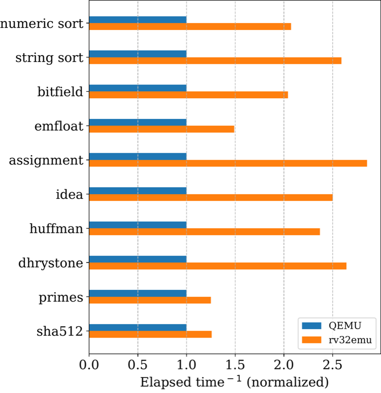

# Benchmarks

The benchmarks are classified based on their characteristics and cover
various aspects of system performance. Most are derived from the
industry-standard BYTEmark (nbench) suite, supplemented by cryptographic
and system benchmarks:

| Benchmark     | Description |
| ------------- | ----------- |
| numeric sort  | Focuses on sorting integer arrays using various algorithms |
| string sort   | Evaluates string sorting capabilities |
| bitfield      | Tests bitwise operations and integer arithmetic on data words |
| emfloat       | Focuses on emulating floating-point calculations using integer arithmetic |
| assignment    | Tests solving resource allocation problems (e.g., assignment algorithm) |
| idea          | Assesses encryption and decryption using the International Data Encryption Algorithm (IDEA) |
| huffman       | Measures performance in data compression using Huffman coding |
| dhrystone     | Assesses general integer performance with a mix of string processing and control operations |
| primes        | Measures efficiency in computing prime numbers using algorithms like the Sieve of Eratosthenes |
| sha512        | Tests cryptographic hash computations |

These benchmarks were performed by rv32emu (with tiered JIT enabled) and
QEMU v9.0.0 on an Intel Core i7-11700 CPU running at 2.5 GHz with Ubuntu
Linux 22.04.1 LTS. The toolchain used was GCC v14.2.0 with RV32IM
extensions.

The figure below illustrates the speedup (normalized reciprocal of average
elapsed time over 200 iterations) of rv32emu with tiered JIT compilation
compared to QEMU. Higher values indicate better performance.

Performance summary:
- rv32emu with tiered JIT compilation outperforms QEMU v9.0.0 across all benchmarks
- Significant performance gains in compute-intensive workloads (primes, sha512, emfloat)
- Strong performance in optimization and cryptography benchmarks (assignment, idea, huffman)
- Consistent advantages in sorting operations (numeric sort, string sort)
- The tiered JIT approach effectively balances compilation overhead with code optimization quality

## Continuous benchmarking

Continuous benchmarking is integrated into GitHub Actions, allowing the
committer and reviewer to examine the comment on benchmark comparisons
between the pull request commit(s) and the latest commit on the master
branch within the conversation. This comment is generated by the benchmark
CI and provides an opportunity for discussion before merging.

The results of the benchmark will be rendered on a
[GitHub page](https://sysprog21.github.io/rv32emu-bench/). Check
[benchmark-action/github-action-benchmark](https://github.com/benchmark-action/github-action-benchmark)
for the reference of benchmark CI workflow.

Modifications to any of the following paths trigger the benchmark CI (see
`.github/workflows/benchmark.yml` for the authoritative list):
* `src/riscv.c`
* `src/decode.c`
* `src/emulate.c`
* `src/rv32_template.c`
* `src/rv32_constopt.c`
* `src/cache.c`
* `src/io.c`
* `src/jit.c`
* `mk/kconfig.mk`
* `mk/toolchain.mk`
* `tools/detect-env.py`
