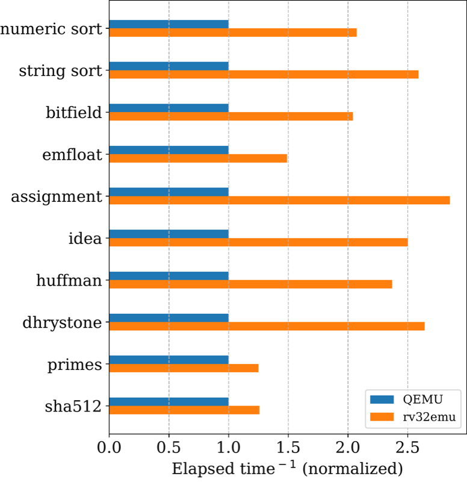

# Benchmarks

The benchmarks are classified based on their characteristics and cover
various aspects of system performance. Most are derived from the
industry-standard BYTEmark (nbench) suite, supplemented by cryptographic
and system benchmarks:

| Benchmark     | Description |
| ------------- | ----------- |
| numeric sort  | Focuses on sorting integer arrays using various algorithms |
| string sort   | Evaluates string sorting capabilities |
| bitfield      | Tests bitwise operations and integer arithmetic on data words |
| emfloat       | Focuses on emulating floating-point calculations using integer arithmetic |
| assignment    | Tests solving resource allocation problems (e.g., assignment algorithm) |
| idea          | Assesses encryption and decryption using the International Data Encryption Algorithm (IDEA) |
| huffman       | Measures performance in data compression using Huffman coding |
| dhrystone     | Assesses general integer performance with a mix of string processing and control operations |
| primes        | Measures efficiency in computing prime numbers using algorithms like the Sieve of Eratosthenes |
| sha512        | Tests cryptographic hash computations |

These benchmarks were performed by rv32emu (with tiered JIT enabled) and
QEMU v9.0.0 on an Intel Core i7-11700 CPU running at 2.5 GHz with Ubuntu
Linux 22.04.1 LTS. The toolchain used was GCC v14.2.0 with RV32IM
extensions.

The figure below illustrates the speedup (normalized reciprocal of average
elapsed time over 200 iterations) of rv32emu with tiered JIT compilation
compared to QEMU. Higher values indicate better performance.



Performance summary:
- rv32emu with tiered JIT compilation outperforms QEMU v9.0.0 across all benchmarks
- Significant performance gains in compute-intensive workloads (primes, sha512, emfloat)
- Strong performance in optimization and cryptography benchmarks (assignment, idea, huffman)
- Consistent advantages in sorting operations (numeric sort, string sort)
- The tiered JIT approach effectively balances compilation overhead with code optimization quality

## Interpreter comparison

`tests/interpreter_bench.py` measures the workloads listed above using
externally timed process lifetimes. It compares interpreter-only rv32emu with
libriscv while explicitly disabling libriscv translation:

```sh
python3 tests/interpreter_bench.py \
    --libriscv <path-to-compatible-libriscv-rv32-runner> \
    --libriscv-build-flags '-DRISCV_BRK_MEMORY_SIZE=33554432' \
    --runs 3 --warmup 1 --json build/interpreter-bench.json
```

Use `--libriscv-args` when a compatible runner needs runtime options. For
example, the ARM64 32 MiB runner is invoked with `--libriscv-args '-m 32'`.

By default the runner skips `bitfield` and `idea`, whose single interpreter runs
take many minutes. Pass `--workloads all` to include them, or a comma-separated
list of workload names to select a subset.

The runner verifies an interpreter-only effective configuration, interleaves
the two engines, retains raw samples and build provenance in the JSON report,
and returns failure unless rv32emu wins every workload by the configured
statistical margin (2% by default).

The libriscv runner must support these static newlib guests and accept `-n` to
disable translation. The runner preflight compares normalized guest output and
refuses to time a workload if either emulator fails or produces a different
result. `primes` needs more than libriscv's stock 16 MiB `brk` cap, so build
the RV32 newlib runner with `-DRISCV_BRK_MEMORY_SIZE=33554432`.

## Dhrystone and CoreMark

`tests/bench.py` runs the prebuilt Dhrystone and CoreMark guests, which
`make artifact` fetches. It measures whatever `build/rv32emu` was built as;
`--emu` selects another binary, and `--label` names the execution mode so that
results from different modes stay apart:

```sh
make interpreter_defconfig && make && python3 tests/bench.py
make defconfig && make && python3 tests/bench.py --label T1C
make jit_defconfig && make && python3 tests/bench.py --label T2C
```

CoreMark results are rejected when the guest reports a checksum mismatch, so a
miscompiling JIT cannot post a score.

Reference results (mean of three runs; the eMAG interpreter Dhrystone ran once,
because one run exceeds five minutes):

| Host | Mode | Dhrystone (DMIPS) | CoreMark (iterations/s) |
| --- | --- | ---: | ---: |
| AMD Threadripper 2990WX, GCC 14.2 | Interpreter | 2,533 | 1,835 |
| | T1C | 16,269 | 7,081 |
| | T2C | 33,365 | 13,272 |
| Ampere eMAG, Clang 18.1 | Interpreter | 792 | 703 |
| | T1C | 7,052 | 4,640 |
| | T2C | 10,273 | 6,164 |

Apple Silicon results can be collected by dispatching the benchmark workflow
manually; its `apple-silicon` job runs all three modes on a macOS arm64 runner.

### Comparing two builds

Scores from different machines, or from one shared machine at different times,
differ by far more than most changes do. To judge a change, build both
revisions in the same mode and let `--baseline` measure them side by side:

```sh
git worktree add ../rv32emu-base origin/master
make -C ../rv32emu-base jit_defconfig && make -C ../rv32emu-base ENABLE_T2C=0
python3 tests/bench.py --label T1C --runs 6 --parallel 2 \
    --baseline ../rv32emu-base/build/rv32emu --emu build/rv32emu
```

Each pair runs the baseline and the candidate at the same time, so both see
the same interference ("duet benchmarking"), and alternates which starts
first. The report gives the geometric mean of the per-pair ratios with a 95%
confidence interval over all pairs. A change is reported as faster or slower
only when its interval excludes zero and it exceeds `--threshold` (2% by
default). A pair in which only one member was disturbed widens the interval,
so a noisy host yields "no significant change" rather than a false verdict;
add pairs with `--runs` to recover precision. `--parallel 2` runs the
Dhrystone and CoreMark pairs at the same time, which needs four idle CPUs.
`--schedule interleaved` runs the two members of a pair one after the other
instead, which suits hosts with too few idle CPUs for two emulators.

Two host effects are worth knowing when reading results:

- Address space layout randomization moves the emulator and its JIT buffer.
  On an x86-64 host, T1C Dhrystone ranged from 15,600 to 17,300 DMIPS across
  runs with randomization and within 0.8% without it. The runner leaves it
  enabled, because one fixed layout can favor one binary over another, and
  relies on repeated pairs instead.
- An identical-binary (A/A) comparison is a quick check that a host is quiet
  enough: it should report no significant change.

## Continuous benchmarking

`.github/workflows/benchmark.yml` measures the interpreter, T1C, and T2C.

For a pull request, each mode is built twice on one runner: from the pull
request merged into master, and from the master commit it merges into. The
comparison above then runs on that runner, and its table appears in the job
summary. `.github/workflows/benchmark-comment.yml` posts the tables as a single
pull request comment, updated on each push. Pull request results are never
recorded on the dashboard.

Each push to master records all three modes on the
[dashboard](https://sysprog21.github.io/rv32emu-bench/), built with
[github-action-benchmark](https://github.com/benchmark-action/github-action-benchmark).
The interpreter keeps the original `Dhrystone` and `CoreMark` series; the JIT
modes appear as `Dhrystone (T1C)`, `CoreMark (T2C)`, and so on. Each entry
names the runner CPU. The dashboard shows long-term trends. It cannot show
small changes, because GitHub assigns runners of different speeds. Before this
workflow compared each pull request against its own base, one master commit had
dashboard entries of 2,157 and 3,950 DMIPS.

Changes to `src/`, `configs/`, `mk/`, the `Makefile`, `tools/detect-env.py`,
`tests/bench.py`, or the workflow itself trigger the benchmark (see
`.github/workflows/benchmark.yml` for the authoritative list).
