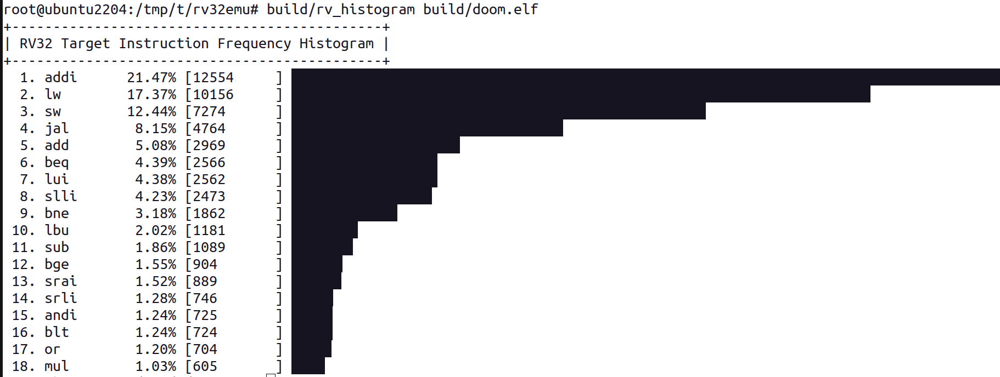
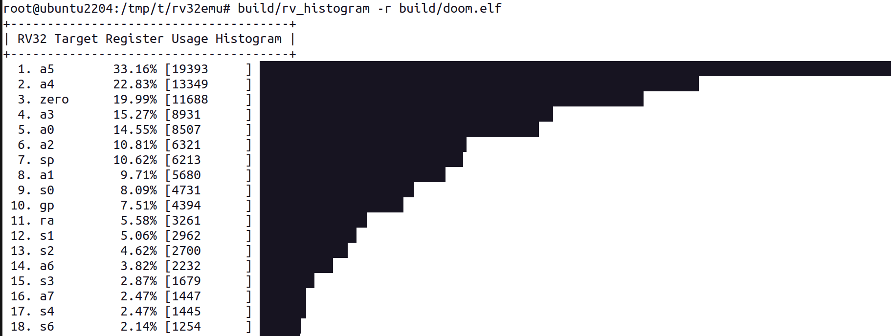

# Static analysis tools

## RISC-V instructions / registers (rv_histogram)

This is a static analysis tool for assessing the usage of RV32
instructions/registers in a given target program. Build this tool by
running the following command:
```shell
$ make tool
```

After building, you can launch the tool using the following command:
```shell
$ build/rv_histogram [-ar] [target_program_path]
```

The tool includes two optional options:
* `-a`: output the analysis in ascending order (default is descending order)
* `-r`: output usage of registers (default is usage of instructions)

_Example instructions histogram_


_Example registers histogram_


## Basic block profiler (rv_profiler)

To install [lolviz](https://github.com/parrt/lolviz), use the following command:
```shell
$ pip install lolviz
```

For macOS users, it might be necessary to install additional dependencies:
```shell
$ brew install graphviz
```

Build the profiling data by executing `rv32emu`. This can be done as follows:
```shell
$ build/rv32emu -p build/[test_program].elf
```

To analyze the profiling data, run `rv_profiler` from the project root
(the script reads `build/<test_program>.prof`):
```shell
$ tools/rv_profiler [--start-address ADDR] [--stop-address ADDR] [--graph-ir ADDR] <test_program>
```
`<test_program>` is the basename of the ELF passed to `rv32emu -p` (for
`build/rv32emu -p build/hello.elf`, pass `hello.elf`). Each `--*-address`
flag takes a hexadecimal address.
